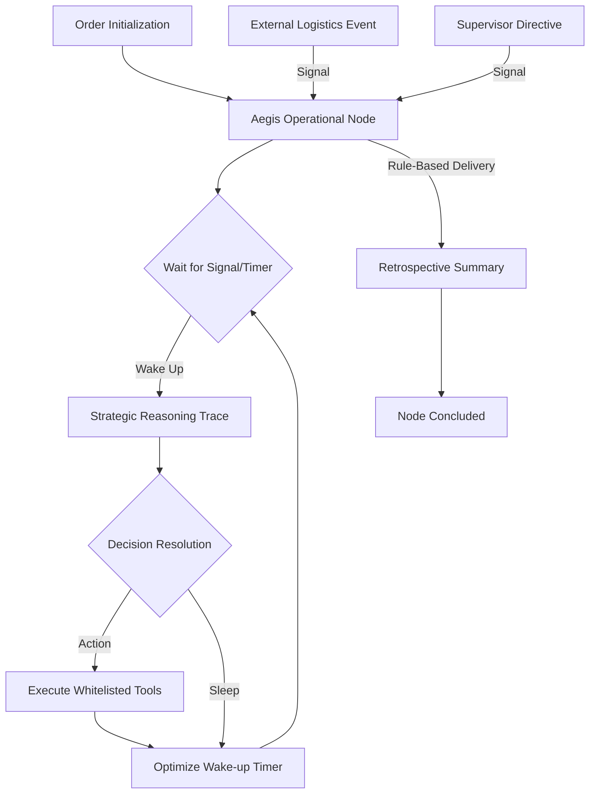

# 🛡️ Aegis Command Center: Autonomous Order Supervisor

**Aegis** is a mission-critical Proof of Concept (POC) for long-running, autonomous AI supervision. It leverages **Temporal** for durable state orchestration and **Generative Intelligence** (OpenRouter/Gemini) to manage complex e-commerce order lifecycles with deterministic precision.

[](docs/SYSTEM_DOCUMENTATION.md)
[](LICENSE)

---

## 🏗️ Architectural Core

Aegis is built on an event-sourced, durable orchestration model. Instead of transient microservices, every order is treated as a **Long-Lived Operational Node** that maintains its own strategic trace, memory, and audit trail over days or weeks.

### Operational Flow (Durable Loop)


---

## 🛰️ Core Capabilities & Benchmarks

- **Triple-Trigger Supervision**: Native support for start-time reasoning, real-time signal processing, and scheduled "check-in" timers.
- **Deterministic Lifecycle Rules**: Workflow termination is governed by system-defined completion rules (e.g., successful delivery), ensuring the supervisor remains active until the mission is truly complete.
- **Strategic Reasoning Trace**: Every decision is logged as a "Cognitive Monologue," providing full transparency into the AI's internal logic and confidence scores.
- **Circuit Breaker & LLM Failover**: Automated resiliency protocols trip a circuit breaker on API rate limits, falling back to a secondary logic-engine to prevent mission stalling.
- **High-Density 'Lumina' UI**: A professional, command-center dashboard designed for high-throughput operational monitoring.

---

## 🏗️ Technical Stack

-   **Orchestration**: [Temporal Python SDK](https://github.com/temporalio/sdk-python)
-   **Intelligence Layer**: OpenAI-compatible API (Google Gemini Pro / Flash / Llama 3.1 via OpenRouter)
-   **Backend**: FastAPI (Python 3.10+)
-   **Data Persistence**: SQLModel with SQLite (WAL Mode enabled)
-   **Frontend**: Next.js 15, Tailwind CSS v4, Lucide React (Ergonomic Minimalist Design)

---

## 🚀 Deployment & Setup

### 1. Environment Configuration
Clone the repository and initialize your environment settings:
```bash
cp .env.example .env
```
Ensure you provide either a `GOOGLE_API_KEY` or `OPENROUTER_API_KEY`.

### 2. Launch Sequence (Standard)
The project includes a unified orchestrator to launch all services:
```bash
python dev.py
```
This starts:
1.  **Temporal Server** (Developer Mode)
2.  **FastAPI Mission API** (Port 8000)
3.  **Aegis Worker** (Agent logic processing)
4.  **Lumina Dashboard** (Port 3000)

### 3. Verification Suite
Run the professional audit suite to verify end-to-end logic:
```bash
$env:PYTHONPATH="backend"; .\.venv\Scripts\python.exe scripts\verify_system.py
```

---

## 🛡️ Operational Guardrails

-   **Tool Whitelisting**: Every agent action is validated against a server-side `ALLOWED_ACTIONS` whitelist.
-   **Deterministic Completion**: Termination logic is decoupled from the agent to prevent premature mission closure.
-   **Idempotency**: `event_id` tracking ensures signals are never double-processed.

---
